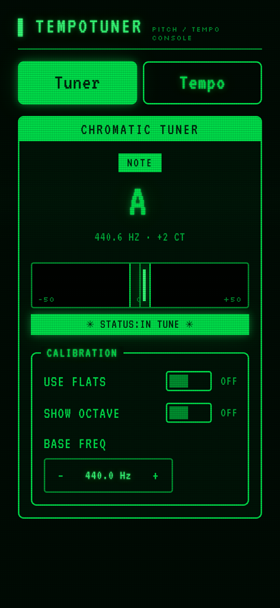
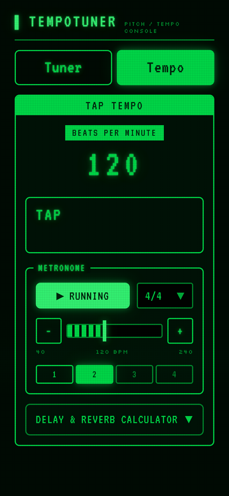
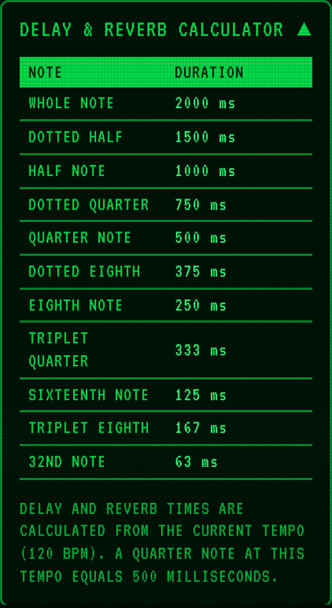

<p align="center">
  
</p>

<h1 align="center">TempoTuner</h1>

<p align="center">
  A chromatic tuner, metronome and tap tempo in the browser, styled as a phosphor-green console.<br>
  <a href="https://tempotuner.fourpixels.workers.dev">tempotuner.fourpixels.workers.dev</a>
</p>

<p align="center">
  
  
  
</p>

## Features

- **Chromatic tuner** — real-time pitch detection (YIN) from the microphone, with an adjustable A4 reference, sharps or flats, and an optional octave
- **Tap tempo** — tap the pad or any key to find a song's BPM
- **Metronome** — 40–240 BPM in simple, compound and odd time signatures, with a visual beat indicator that shows where the accents fall
- **Delay & reverb calculator** — note durations in milliseconds for the current tempo
- Runs on mobile and desktop and can be installed to the home screen. Everything happens in the browser; no audio leaves the device

The microphone needs a secure context (HTTPS or `localhost`). On iPhone the metronome asks Safari for a media audio session so the silent switch does not mute it.

## Tech

Next.js 16 (static export), React 19, TypeScript, Tailwind CSS v4 and Radix UI primitives. Audio is plain Web Audio: an `AnalyserNode` feeding an FFT-based YIN pitch detector, and a look-ahead scheduler for the metronome clicks.

The visual design adapts [Amber Console](https://github.com/DutchDiederik/AmberConsole) by Diederik (BSD-3-Clause), with the amber swapped for a single green phosphor ramp. Design tokens live in `app/globals.css`.

## Getting started

Requires Node.js 22+ and pnpm.

```bash
pnpm install
pnpm dev
```

| Script | |
|---|---|
| `pnpm dev` | Dev server |
| `pnpm build` | Static export to `out/` |
| `pnpm lint` | ESLint |
| `pnpm test` | All tests (`test:unit`, `test:security` for one suite) |
| `pnpm run deploy` | Build and deploy to Cloudflare Workers — see [DEPLOY.md](DEPLOY.md) |

```
app/          Next.js page, layout, manifest and sitemap
components/   Tuner, tap tempo, metronome and UI primitives
hooks/        useTuner
utils/        Pitch detection, FFT, note math, metronome timing
tests/        Unit (195) and security (19) tests
```

## License

Free and open source under the [MIT License](LICENSE).

The theme adapts Amber Console, Copyright (c) 2026 Diederik, under the BSD 3-Clause License; its notice is kept in [`LICENSES/amber-console.BSD-3-Clause.txt`](LICENSES/amber-console.BSD-3-Clause.txt).
